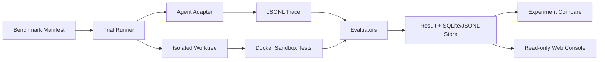
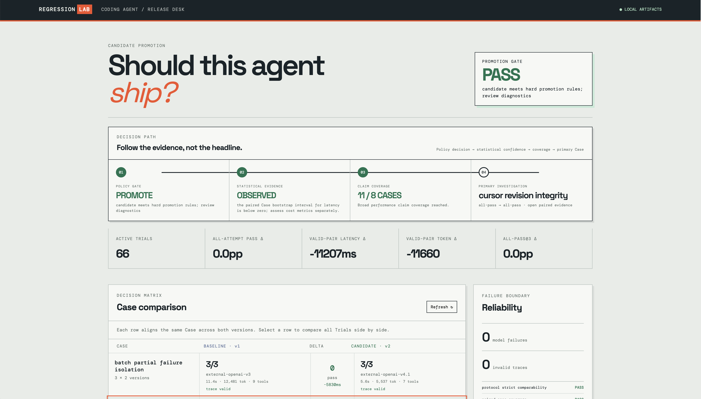
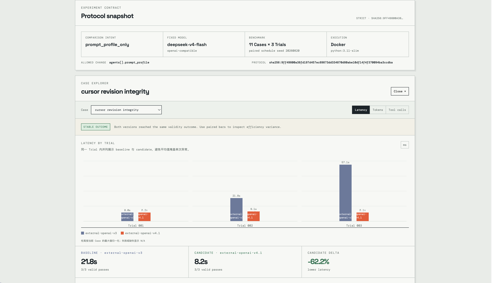
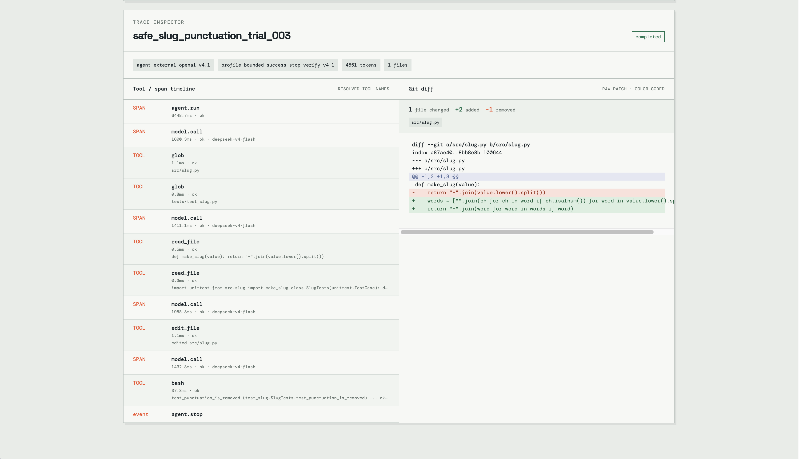
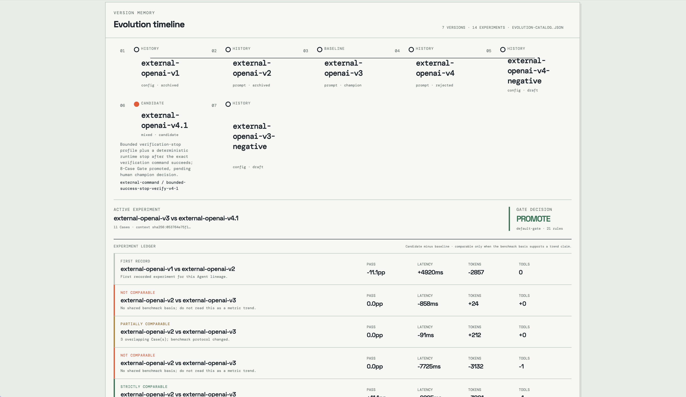

# Regression Lab — Agent Observability & Evaluation Platform

面向 Coding Agent 的本地可观测与评测平台。它把一次 Agent 修复任务收敛为可复现的 Trial：在隔离 Worktree 中执行、记录 JSONL Trace、运行确定性评测器，并将多版本 Agent 的结果汇总为可审计实验。

> 项目边界：本仓库负责 **观测、评测、实验与展示**，不绑定某一个 Agent 框架。`react-agent` 是可直接接入真实模型的参考 Adapter；`external-command` 可将任意本地 Agent 以 JSONL 观测契约接入；`readonly-replay` 是可选的外部只读回放 Bridge，执行时必须显式提供 `--replay-source /path/to/agent_entry.py`。

## 为什么做它

Agent 的“任务完成了”不足以支持工程决策。Regression Lab 回答四个问题：

- 是否真的通过了目标测试，且只修改了允许的文件？
- Agent 调用了哪些模型与工具，耗时、调用数和 Token 是多少？
- 同一任务上，候选版本相对基线的通过率和成本是否发生回归？
- 出问题时，能否从 Result、Trace、Git Diff 和评分 Evidence 复盘？

## 核心能力

- **Adapter 契约**：支持替换真实 Coding Agent；现有 `react-agent` 采用 OpenAI-compatible function calling。
- **安全执行**：每个 Trial 使用独立 Worktree；Docker 默认 `network=none`、只读根文件系统、去能力、CPU/内存/PID 限额；路径和工具均有 Allow/Deny Policy。
- **可观测性**：JSONL Trace 覆盖 `agent.run`、`model.call`、权限检查、工具调用、测试和上下文压缩；SQLite + JSONL 保存 Run Store。
- **自动评测**：测试、Diff、路径策略、Trace 完整性、工具完整性和预算六类 Evaluator 统一输出带 Evidence 的 Score。
- **实验与看板**：Case × Trial × Agent Version 对比；本地只读 Web Console 提供 Gate 总览、11 Case 选择器、成对柱状图、单 Trial Trace、工具调用和 Diff。



## 快速开始

要求：Python 3.11、Git、Docker Desktop。项目运行时不依赖第三方 Python 包。

```bash
cd "$(git rev-parse --show-toplevel)"
make test
make docker-test
make manifest-check
```

`make test` 默认跳过 Docker 集成测试，保证编辑代码时反馈快速；`make docker-test` 显式验证真实容器的网络隔离、只读根文件系统和超时边界。

## Release Desk Preview

Gate 总览将 11 Case × 3 次重复的正式实验结论、可靠性与成本变化放在同一屏。



Case Explorer 将同一任务的三次 Trial 按 baseline/candidate 并列为柱状对比，并汇总通过率、Token 与工具调用；Protocol Snapshot 同时展示严格可比性与冻结配置。



选中任一 Trial 后，Trace Inspector 展示真实模型调用、已解析工具名称和 Git Diff，用于定位一次评测结论的完整证据链。



Evolution Timeline 保留各 Agent 版本、历史实验和 Gate 决策；页面会明确标注不可直接比较的 Benchmark 范围，避免把不同实验混写成趋势。



### 启动观察控制台

仓库已经包含一份真实核心实验的本地产物时，可直接启动：

```bash
cd "$(git rev-parse --show-toplevel)"
make console
```

打开 `http://127.0.0.1:8765`。控制台只读取已有 Artifact，不会执行 Agent、写入数据库或暴露模型密钥。

### 接入真实 Agent

复制环境变量模板，并在终端加载（模板不会被程序自动读取）：

```bash
cd "$(git rev-parse --show-toplevel)"
cp .env.example .env
# 编辑 .env，填入 AGENT_API_KEY 和 AGENT_MODEL
set -a; source .env; set +a
make real-smoke
```

真实 Trial 默认使用 Docker Sandbox。所有密钥只存在于启动进程环境中，绝不会写入 Manifest、Trace、Result、SQLite 或 JSONL。

更多接入约束见 [Adapter Contract](docs/ADAPTER_CONTRACT.md)，真实模型配置见 [Real Agent Setup](docs/REAL_AGENT_SETUP.md)，失败状态与证据链见 [Failure Semantics](docs/FAILURE_SEMANTICS.md)。

### 接入任意本地 Agent

不使用既有框架也可以接入。平台以 `shell=false` 运行你显式提供的 JSON argv，在每个隔离 Worktree 中注入 Trial 身份、Trace 路径和受控输出路径。你的 Python Agent 只需使用 `AgentObserver.from_environment()` 包裹 `agent.run`、`model.call` 与 `tool.call`，最后用 `write_agent_output()` 写入简短结论。

可先用仓库的无模型示例完成一次本地链路验证：

```bash
cd "$(git rev-parse --show-toplevel)"
python3.11 scripts/run_benchmark.py \
  --adapter external-command \
  --agent-version external-example-v1 \
  --external-command "[\"python3.11\", \"$(pwd)/examples/external_python_agent.py\"]" \
  --manifest benchmarks/smoke-case-design.yaml \
  --output-dir .runtime/external-example \
  --unsafe-trusted-host
```

这不是安全沙箱：v1 只运行你自己明确配置、信任的本地命令。平台仍独立执行测试、收集 Git Diff、校验 Trace、计算 Score 和 Gate；Agent 不能通过输出文件覆盖这些结论。完整字段约束与真实模型接入步骤见 [External Agent Integration Contract](docs/EXTERNAL_AGENT_INTEGRATION_CONTRACT.md)。

仓库也提供真实模型的零框架参考实现 [external_openai_agent.py](examples/external_openai_agent.py)。配置好既有 `AGENT_API_KEY` 和 `AGENT_MODEL` 后，执行 `make external-real-smoke`。它只允许 Agent 以非 Shell 方式执行平台注入的精确测试命令，平台仍会独立重跑测试。其 `external-openai-v1/v2/v3` 共享 Agent 代码、模型、工具、Case 与预算，只让 Prompt Profile 发生变化，适合进行归因清晰的版本实验；阶段 6 的 `v2 → v3` 结果见 [External v2/v3 Report](docs/EXPERIMENT_REPORT_EXTERNAL_V2_V3.md)。

当前正式 Benchmark 包含 **11 个确定性 Case**。在 V3 → V4.1 的 66 条真实 Trial 中，两版本均为 33/33 有效通过；V4.1 平均少 11,660 Token（-66.3%）、少 2.82 次工具调用、少 11.21 秒，Gate 为 `PROMOTE`。同范围的 V3 → V3-negative 负向对照也保持 33/33 通过，但因两次受控的终止后冗余模型调用使平均 Token 增加 49.9%，Gate 正确给出 `HOLD`。完整证据见 [V3→V4.1 正向报告](docs/EXPERIMENT_REPORT_EXTERNAL_V3_V4_1_BENCHMARK_V2.md) 与 [负向对照报告](docs/EXPERIMENT_REPORT_EXTERNAL_V3_NEGATIVE_CONTROL_BENCHMARK_V2.md)。

## 可复现实验

当前对外展示的核心集包含 11 个确定性 Python 修复任务。正式实验使用按 Case 聚类的 Bootstrap、冻结的 Protocol 与运行时 Agent 源码 Hash，避免把随机波动、模型失败或不同 Benchmark 范围误写成版本收益。V3 → V4.1 的结果支持晋级；V3 → V3-negative 的负向对照证明 Gate 能拦截正确率不变、成本却退化的候选。

早期 8 Case 实验仍保留为历史对照，但不与当前 11 Case 结果拼接计算指标。外接 Agent 的完整版本谱系与证据范围见 [Evolution Runbook](docs/EXTERNAL_AGENT_EVOLUTION.md)。

当 `--resume` 遇到已完成但 Trace 或评测无效的 Trial 时，默认保留它作为失败证据；显式加 `--rerun-invalid` 才会把原 Artifact 移至 `invalid-attempts/` 后重新执行，避免静默覆盖。

若只需根据已完成 Artifact 刷新对比报告，使用 `scripts/run_experiment.py --report-only`（或 `make experiment-report RUNTIME=...`）；该模式不会执行 Agent，也不会读取模型密钥。

使用 [Gate Policy](docs/GATE_POLICY.md) 将实验结论变成可执行晋级规则：`make gate RUNTIME=.runtime/repeated-experiment-v1-v2`。

## 项目结构

```text
adapters/       Agent 适配层（external-command、readonly-replay、react-agent）
benchmarks/     Benchmark Case Manifest
fixtures/       有缺陷的最小代码任务与验收测试
src/            Runner、Sandbox、Trace、Store、Evaluator、Dashboard
scripts/        Benchmark、Experiment、Console CLI
tests/          单元测试与显式 Docker 集成测试
web/            零依赖本地只读控制台
docs/           契约、设计决策、实验报告与演示材料
```

## CI 与发布说明

`.github/workflows/verify.yml` 会运行离线单测、Docker 集成测试、预期失败探针和所有 Manifest 校验；不会调用真实模型或要求密钥。仓库根目录就是可直接 clone 和运行的独立项目目录。

发布前按 [Release Checklist](docs/RELEASE_CHECKLIST.md) 检查；当前稳定版本的审计见 [Release Audit](docs/RELEASE_AUDIT.md)。
