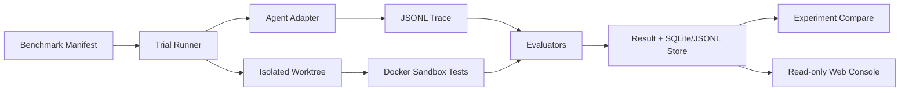
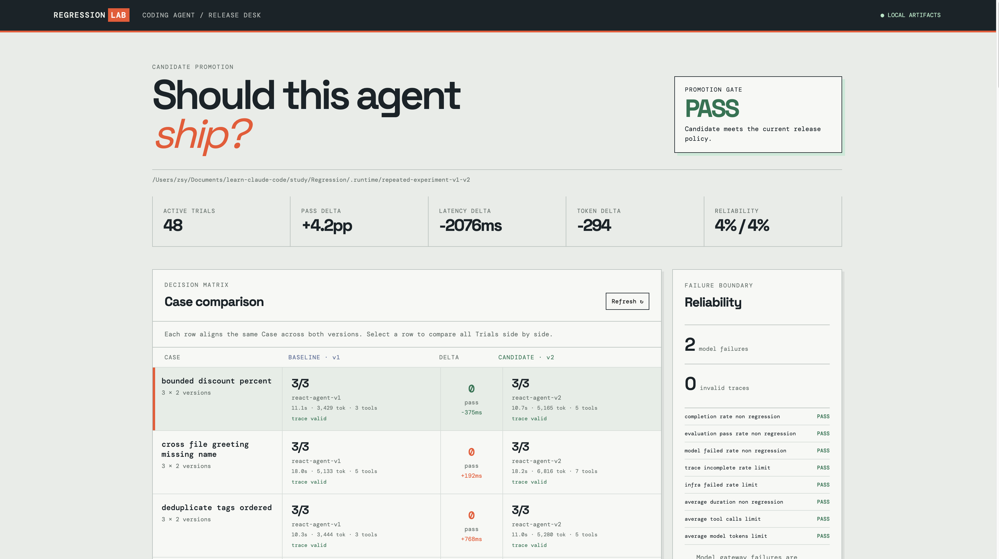
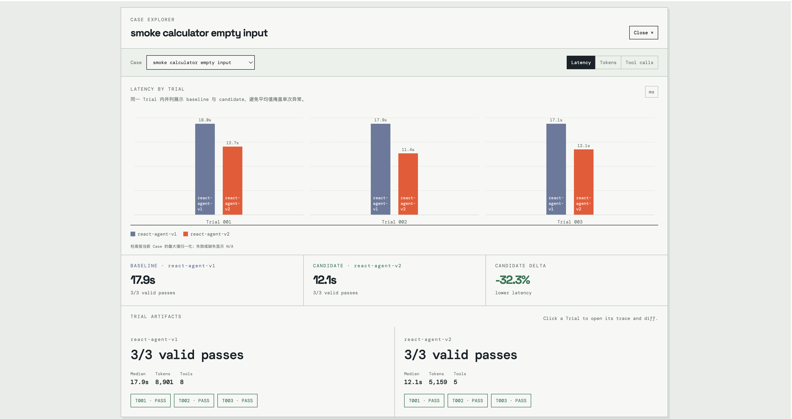
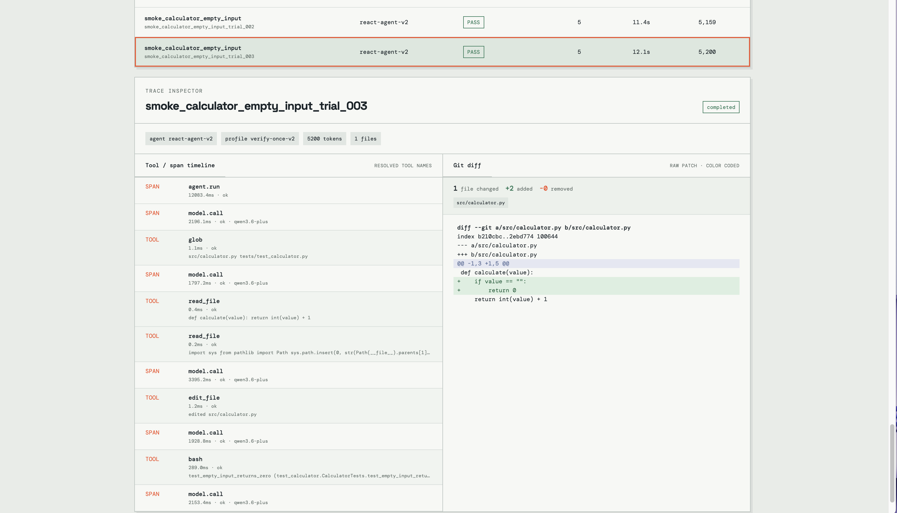

# Regression Lab — Agent Observability & Evaluation Platform

面向 Coding Agent 的本地可观测与评测平台。它把一次 Agent 修复任务收敛为可复现的 Trial：在隔离 Worktree 中执行、记录 JSONL Trace、运行确定性评测器，并将多版本 Agent 的结果汇总为可审计实验。

> 项目边界：本仓库负责 **观测、评测、实验与展示**，不绑定某一个 Agent 框架。`react-agent` 是可直接接入真实模型的参考 Adapter；`s20-replay` 是可选的外部 S20 只读 Bridge，执行时必须显式提供 `--s20-source /path/to/s20_comprehensive/code.py`。

## 为什么做它

Agent 的“任务完成了”不足以支持工程决策。Regression Lab 回答四个问题：

- 是否真的通过了目标测试，且只修改了允许的文件？
- Agent 调用了哪些模型与工具，耗时、调用数和 Token 是多少？
- 同一任务上，候选版本相对基线的通过率和成本是否发生回归？
- 出问题时，能否从 Result、Trace、Git Diff 和评分 Evidence 复盘？

## 核心能力

- **Adapter 契约**：支持替换真实 Coding Agent；现有 `react-agent` 采用 OpenAI-compatible function calling。
- **安全执行**：每个 Trial 使用独立 Worktree；Docker 默认 `network=none`、只读根文件系统、去能力、CPU/内存/PID 限额；路径和工具均有 Allow/Deny Policy。
- **可观测性**：JSONL Trace 覆盖 `agent.run`、`model.call`、权限检查、工具调用、测试和上下文压缩；SQLite + JSONL 保存 Run Store。
- **自动评测**：测试、Diff、路径策略、Trace 完整性、工具完整性和预算六类 Evaluator 统一输出带 Evidence 的 Score。
- **实验与看板**：Case × Trial × Agent Version 对比；本地只读 Web Console 提供 Gate 总览、8 Case 选择器、v1/v2 成对柱状图、单 Trial Trace、工具调用和 Diff。



## 快速开始

要求：Python 3.11、Git、Docker Desktop。项目运行时不依赖第三方 Python 包。

```bash
cd study/Regression
make test
make docker-test
make manifest-check
```

`make test` 默认跳过 Docker 集成测试，保证编辑代码时反馈快速；`make docker-test` 显式验证真实容器的网络隔离、只读根文件系统和超时边界。

## Release Desk Preview

Gate 总览将 48 条真实 Trial 的版本结论、可靠性与成本变化放在同一屏。



Case Explorer 将同一任务的三次 Trial 按 v1/v2 并列为柱状对比，并汇总通过率、Token 与工具调用。



选中任一 Trial 后，Trace Inspector 展示真实模型调用、已解析工具名称和 Git Diff，用于定位一次评测结论的完整证据链。



### 启动观察控制台

仓库已经包含一份真实核心实验的本地产物时，可直接启动：

```bash
cd study/Regression
make console
```

打开 `http://127.0.0.1:8767`。控制台只读取已有 Artifact，不会执行 Agent、写入数据库或暴露模型密钥。

### 接入真实 Agent

复制环境变量模板，并在终端加载（模板不会被程序自动读取）：

```bash
cd study/Regression
cp .env.example .env
# 编辑 .env，填入 AGENT_API_KEY 和 AGENT_MODEL
set -a; source .env; set +a
make real-smoke
```

真实 Trial 默认使用 Docker Sandbox。所有密钥只存在于启动进程环境中，绝不会写入 Manifest、Trace、Result、SQLite 或 JSONL。

更多接入约束见 [Adapter Contract](docs/ADAPTER_CONTRACT.md)，真实模型配置见 [Real Agent Setup](docs/REAL_AGENT_SETUP.md)，失败状态与证据链见 [Failure Semantics](docs/FAILURE_SEMANTICS.md)。

## 可复现实验

当前对外展示的核心集包含 8 个确定性 Python 修复任务，并对 `react-agent-v1` 与 `react-agent-v2` 各执行 3 次：v1 为 22/24 通过（91.7%），v2 为 23/24 通过（95.8%）；v2 全尝试平均耗时降低 11.6%、平均 Token 降低 4.8%，工具调用增加 3.0%。因此结论是**候选版本可晋级，但仍存在工具成本权衡**，不是泛化后的“绝对更好”。

首轮单次实验中，两版本均为 8/8 通过，v2 平均耗时降低 19.0%，但工具调用增加 0.63、Token 增加 3.0%；该结果保留为早期对照，不替代全量重复实验结论。

初始 8 Case 单次实验见 [Core v1 报告](docs/EXPERIMENT_REPORT_CORE_V1.md)；4 Case × 3 Trial 的早期重复实验见 [Repeated v1/v2 报告](docs/EXPERIMENT_REPORT_REPEATED_V1_V2.md)；完整 8 Case × 3 Trial 结果见 [Full Core Report](docs/EXPERIMENT_REPORT_FULL_CORE_V1_V2.md)。全量结论是：v2 的通过率更高、全尝试平均耗时更低，但成功样本的 Token/工具成本略高，因此按 Gate 口径作为候选默认版本，而非绝对成本优化。

当 `--resume` 遇到已完成但 Trace 或评测无效的 Trial 时，默认保留它作为失败证据；显式加 `--rerun-invalid` 才会把原 Artifact 移至 `invalid-attempts/` 后重新执行，避免静默覆盖。

若只需根据已完成 Artifact 刷新对比报告，使用 `scripts/run_experiment.py --report-only`（或 `make experiment-report RUNTIME=...`）；该模式不会执行 Agent，也不会读取模型密钥。

使用 [Gate Policy](docs/GATE_POLICY.md) 将实验结论变成可执行晋级规则：`make gate RUNTIME=.runtime/repeated-experiment-v1-v2`。

## 项目结构

```text
adapters/       Agent 适配层（s20-replay、react-agent）
benchmarks/     Benchmark Case Manifest
fixtures/       有缺陷的最小代码任务与验收测试
src/            Runner、Sandbox、Trace、Store、Evaluator、Dashboard
scripts/        Benchmark、Experiment、Console CLI
tests/          单元测试与显式 Docker 集成测试
web/            零依赖本地只读控制台
docs/           契约、设计决策、实验报告与演示材料
```

## CI 与发布说明

`.github/workflows/verify.yml` 会运行离线单测、Docker 集成测试和所有 Manifest 校验；不会调用真实模型或要求密钥。由于本项目目前位于 `study/Regression` 子目录，若发布到 GitHub，应将该目录作为**独立仓库根目录**推送，这样工作流才能被 GitHub Actions 识别。

演示顺序见 [Demo Script](docs/DEMO_SCRIPT.md)，简历与面试表述见 [Resume Notes](docs/RESUME.md)。
独立发布前按 [Release Checklist](docs/RELEASE_CHECKLIST.md) 检查；当前稳定版本的审计见 [Release Audit](docs/RELEASE_AUDIT.md)；仓库简介、截图说明和视频文案见 [GitHub Release Assets](docs/GITHUB_RELEASE_ASSETS.md)。
