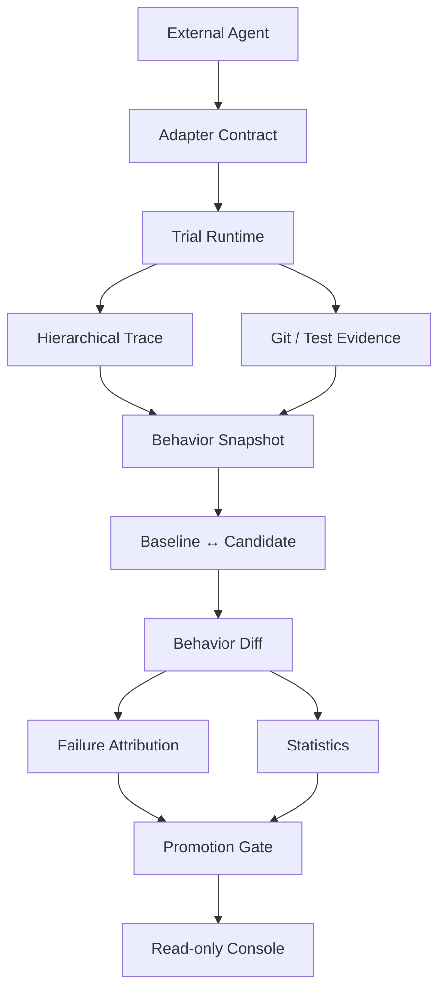

# Regression Lab

**Framework-neutral Agent regression evaluation and observability platform for reproducible version comparison.**

Regression Lab 不把一次 Agent 运行当成“任务成功/失败”的黑盒，而是把它变成一条可复查的工程证据链：同一 Case 上的 Baseline 与 Candidate 到底做了什么、为什么更好或更差、失败发生在哪个 Span，以及是否足以支持发布决策。



## 它解决什么问题

一个 Agent 版本“测试通过”还不足以证明它值得发布。工程决策通常还需要回答：

- 两个版本是否在同一组可复现的 Case × Trial 条件下比较？
- Candidate 的 Token、耗时或工具调用变化，来自什么可观察的行为变化？
- 一个失败能否回到具体的 Trace Span、工具调用、测试或 Git Evidence？
- 缺少证据时，系统会不会把 unknown 伪装成 `0`？
- 通过率不变、但成本明显退化时，Gate 会不会阻止晋级？

Regression Lab 将这些问题统一在一次版本实验中，而不是依赖人工读日志或单一平均分。

## 核心链路

| 层次 | 职责 | 关键输出 |
|---|---|---|
| External Agent | 任意可信本地 Coding Agent | 通过 JSON argv 启动，不绑定框架 |
| Adapter Contract | 隔离平台与 Agent 的职责 | Trial 身份、受控输出、Capability Snapshot |
| Trial Runtime | Attempt 独立临时 Git 工作目录、测试、Git Evidence、预算 | 不可变 Attempt 与选中的 Trial 投影 |
| Hierarchical Trace | 记录通用 agent/workflow/llm/tool Span | JSONL Trace，保留父子关系 |
| Behavior Snapshot | 从 Trace/Result 提取可量化行为 | Tool、Token、延迟、重复读取、重试等 |
| Behavior Diff | 配对 Baseline/Candidate Trial | Delta、语义模式、Case 聚合 |
| Failure Attribution | 基于确定性证据定位失败 | kind、reason、failure Span、evidence |
| Promotion Gate | 独立于诊断层的发布判断 | `PROMOTE` / `HOLD` / 不可用原因 |
| Console | 只读查看实验、Case、Trial 与 Trace | 从版本差异 drill down 到原始证据 |

## 为什么不是“另一个 Agent 框架”

Regression Lab 不负责规划、记忆、工具编排或替代 Agent Runtime。它只要求外部 Agent 通过 Observer SDK 输出通用 Trace，并由平台独立完成测试、Git Diff、Evaluator 和 Gate。

因此同一条链路可接入：

- 内置的最小 `react-agent`；
- 任意满足 JSONL Observer Contract 的 `external-command` Agent；
- 真实 [LangGraph 集成示例](docs/LANGGRAPH_INTEGRATION.md)，无需新增 LangGraph Adapter 或框架专属核心分支。

## 已验证的证据

正式外部 Agent Benchmark 使用 **11 Case × 3 Trial × 2 Version = 66 个选中 Trial**：

| 对比 | 有效通过 | 关键行为变化 | Gate |
|---|---:|---|---|
| external-openai-v3 → external-openai-v4.1 | 33/33 → 33/33 | 平均少 11,660 Token（-66.3%）、少 2.82 次工具调用、少 11.21 秒 | `PROMOTE` |
| external-openai-v3 → external-openai-v3-negative | 33/33 → 33/33 | 两次受控的终止后冗余模型调用，平均 Token +49.9% | `HOLD` |

这两组实验同时证明：平台既能把效率改善追溯到行为差异，也能在正确率不变时拦截成本退化。详见 [V3→V4.1 正向报告](docs/EXPERIMENT_REPORT_EXTERNAL_V3_V4_1_BENCHMARK_V2.md) 与 [V3→V3-negative 负向对照](docs/EXPERIMENT_REPORT_EXTERNAL_V3_NEGATIVE_CONTROL_BENCHMARK_V2.md)。

## 一键启动

普通使用者不需要克隆仓库、创建虚拟环境或编写 YAML。macOS/Linux 上安装 [uv](https://docs.astral.sh/uv/) 后直接运行：

```bash
uvx --from "git+https://github.com/Zsyyyyyyyy/agent-observability-and-evaluation-platform.git@v1.3.3" regression-lab start
```

命令会启动并打开本机 Studio。它只监听 `127.0.0.1`；运行记录和 Studio 自动生成的 AgentSpec 默认保存到 `~/.regression-lab/`，不会写入安装目录。第一次只想确认环境可运行时：

```bash
uvx --from "git+https://github.com/Zsyyyyyyyy/agent-observability-and-evaluation-platform.git@v1.3.3" regression-lab doctor
uvx --from "git+https://github.com/Zsyyyyyyyy/agent-observability-and-evaluation-platform.git@v1.3.3" regression-lab demo
```

`demo` 是完全离线、只读的公开演示，不调用模型、不执行外部 Agent。需要长期安装则使用：

```bash
uv tool install "git+https://github.com/Zsyyyyyyyy/agent-observability-and-evaluation-platform.git@v1.3.3"
regression-lab start
```

Studio 中选择 Quick setup，填写两个 Agent 的 Python 路径与入口、选择 Case，即可开始实验。Docker 是默认隔离方式；未安装 Docker 时，必须在页面明确确认“可信主机”才能运行本地 Agent。

### 比较同一个 Agent 仓库的两个状态

真实开发通常只有一个 Agent 仓库。Quick setup 默认选择 **Same Git repository**：填写仓库根目录、Baseline 的 commit/tag，并选择 Candidate 为另一个 commit/tag 或当前未提交工作区。平台会在系统临时目录创建两个源码快照后再运行实验，不会对你的仓库执行 checkout、stash、commit 或写入。

Candidate 工作区中的 tracked 修改和未跟踪文件会进入快照；被 `.gitignore` 排除的文件（例如常见的 `.env`、`.venv`）不会进入。依赖发生变化时，请分别填写两个已准备好的 Python interpreter；平台不会自动执行 `pip install` 或 `uv sync`。

## 五分钟看懂项目（贡献者）

源码贡献要求：Python 3.11、Git、Node.js；Docker Desktop 只用于容器隔离验收。核心验证和离线 Demo 不调用模型。

```bash
cd <repository-root>
python3.11 -m venv .venv
source .venv/bin/activate
pip install -e .

make verify
make offline-demo
```

打开 `http://127.0.0.1:8765`。默认脱敏 Demo 包含 11 个 Case、66 个选中 Trial、完整的模型/工具父子 Span 和 `PROMOTE` Gate，不依赖 Agent 项目或模型服务。它适合沿着 Gate → Comparison → Failure Attribution → Trace Tree 查看完整技术主线。

在页面中按下面的顺序查看技术主线：

1. `Experiment Gate`：候选版本是否满足发布规则；
2. `Case comparison`：同一 Case、同一重复序号的 Baseline/Candidate；
3. `Failure Attribution`：失败属于模型、Agent、Trace、测试还是策略；
4. `Trace structure → Tree`：按 `parent_span_id` 展开 Span；
5. `Git diff`：平台独立采集的最终修改证据。

`make verify` 会运行完整离线测试套件、所有 Benchmark Manifest 校验、Python 编译检查、前端语法检查、两个离线 Demo 的文件摘要检查和 Git 差异检查。Docker 可用时再运行：

```bash
make docker-test
make failure-suite
```

### 查看任意已有实验

Console 只读取本机已有的 Experiment Artifact；`.runtime/` 默认不纳入 Git，因此克隆仓库后需先自行运行或恢复一个实验目录。

```bash
make console RUNTIME=<experiment-runtime-directory>
```

打开 `http://127.0.0.1:8765`。如果默认端口已被占用，可指定 `CONSOLE_PORT=8767`；Console 不执行 Agent、不调用模型、不会写入 Artifact 或暴露密钥。界面说明见 [Web Console](docs/WEB_CONSOLE.md)。

发布可直接打开的只读 Demo 时，不要提交完整 `.runtime/`；使用 [Public Demo Assets](docs/PUBLIC_DEMO_ASSETS.md) 导出脱敏、可校验的 `PROMOTE` 与 `HOLD` 包。

发布结论或演示前，可离线验证整条证据链。该命令会检查 Protocol 指纹、冻结执行计划、选中 Attempt 的内容摘要、Trial 投影、Trace 校验状态、Agent 源码身份以及 Gate 与 Experiment 的关联，不执行 Agent，也不调用模型：

```bash
make verify-runtime RUNTIME=<experiment-runtime-directory>
```

仓库内置 Demo 是移除了 Attempt/Worktree 的公开只读导出包，因此使用独立的 `demo-manifest.json` 文件摘要校验；完整 Runtime 才使用上述 Experiment Artifact Verify。

另一个离线包来自本机现有的 LangGraph v1/v2 黑盒实验，专门展示当前两个外部 Agent 的接入结果：

```bash
make offline-demo DEMO_RUNTIME=demo/standalone-langgraph-v1-v2 CONSOLE_PORT=8766
```

它包含 1 个 Case、3 次配对重复、6 个选中 Trial 和 `HOLD` Gate，其中 Baseline 有 2 次、Candidate 有 1 次确定性任务失败，均归因为 `agent / task_test_failed_or_not_run`。黑盒模式只能展示进程生命周期 Trace；这是观测能力边界，不会伪造模型或工具 Span。

## 使用现有 LangGraph v1/v2 做真实验收

启动 Studio：

```bash
make studio
```

打开 `http://127.0.0.1:8764`，选择 `Quick setup`，无需编写 YAML。对本机已有的两个版本填写：

| 字段 | Baseline | Candidate |
|---|---|---|
| Project | `standalone-langgraph` | 相同 |
| Agent | `standalone-langgraph-agent` | 相同 |
| Version | `v1` | `v2` |
| Launch target | Installed Python module | Installed Python module |
| Python | `<v1-root>/.venv/bin/python` | `<v2-root>/.venv/bin/python` |
| Module | `standalone_langgraph_agent` | `standalone_langgraph_agent` |
| Observation | Black-box | Black-box |

两个 Agent 都按 `--workspace <worktree> --task <task>` 启动。点击 `Save setup` 后，路径和版本只保存在当前浏览器；下次打开 Studio 会自动恢复。可信主机确认不会被保存，启动真实 Agent 前仍需再次确认。

建议先选择一个 Case、一次重复做接入验收；确认源码身份、Trace 和测试证据正常后，再运行三次重复。真实模型调用是可选验收，不属于 `make verify` 或离线 Demo。

## 三分钟验证 Black-box 接入

下面的最小 Agent 只接收通用的 `--workspace` 和 `--task` 参数，不 import Regression Lab、不读取 `REGRESSION_*` 环境变量，也不需要模型配置。它用于验证本机安装、临时 Git 工作目录、Git/Test Evidence 和平台生命周期 Trace。

```bash
cat > blackbox-smoke.yaml <<EOF
schema_version: 1
agent:
  id: blackbox-smoke-agent
  version: v1
runtime:
  command:
    - "$(command -v python)"
    - "$(pwd)/examples/external_blackbox_agent.py"
    - --workspace
    - "{workspace}"
    - --task
    - "{task}"
observation:
  mode: blackbox
EOF

regression-lab --help
regression-lab agent validate blackbox-smoke.yaml
regression-lab agent smoke blackbox-smoke.yaml --unsafe-trusted-host
```

Smoke 成功后会打印 Runtime；可按输出中的命令启动 Console。Black-box 只提供 Agent 进程生命周期、Git 与平台测试证据，因此模型调用、Token、工具调用和 workflow Trace 会明确显示为 `N/A`，不会补成 `0`。

## 接入一个外部 Agent

平台以 `shell=false` 执行显式 JSON argv。Black-box Agent 只需接收 `--workspace {workspace}` 与 `--task {task}`；LangGraph Agent 只需在 `invoke/stream` 入口注入一次 Callback；自研 Runtime 才使用 Native SDK。平台始终独立采集测试、Diff 和评分结论，并在 Artifact 中标记证据来源。

```python
from regression_lab.sdk import AgentObserver

observer = AgentObserver.from_environment()
with observer.run():
    with observer.model_call(model="your-model") as call:
        call.record_usage({"prompt_tokens": 120, "completion_tokens": 30, "total_tokens": 150})
    with observer.tool_call("edit_file"):
        ...

AgentObserver.write_agent_output("done", "completed")
```

完整环境变量、事件字段和受控输出约束见 [External Agent Integration Contract](docs/EXTERNAL_AGENT_INTEGRATION_CONTRACT.md)。无模型最小示例可运行：

```bash
PYTHONPATH=src:. python3.11 scripts/run_benchmark.py \
  --adapter external-command \
  --agent-version external-example-v1 \
  --external-command '["python3.11", "examples/external_python_agent.py"]' \
  --manifest benchmarks/smoke-case-design.yaml \
  --output-dir .runtime/external-example \
  --unsafe-trusted-host
```

要评测自己的项目，请准备基线 Fixture、Case Manifest 和两个 Agent 版本，按 [Using Your Agent](docs/USING_YOUR_AGENT.md) 执行。平台会为每个 Attempt 复制 Fixture、初始化独立临时 Git 仓库并在其中运行 Trial，不会修改用户原始项目。主执行链没有调用 `git worktree add`，面试或文档中不应把它描述成 Git Worktree 隔离。

## v1.3 工程边界

当前 v1.3 系列定位是“可公开演示、可离线验证、可安全接入外部 Agent 的本地评测平台”。在此前版本基础上，进一步稳定实现：

- 无 YAML 的 Studio 双版本实验；
- Trace 树、Comparison、Failure Attribution 和 Gate；
- 不可变 Attempt 与 Experiment Artifact Verify；
- 默认最小外部 Agent 环境；
- 可校验的离线 Demo。
- Runtime Environment Identity、证据来源策略与 LangGraph Trace Conformance。
- 同步双列 Trace Diff、首个结构分叉、关键路径和失败 Span 对齐。
- Studio 取消、原 Runtime 恢复，以及 Studio 重启后的已取消实验发现。

其中 Capability 明确区分 `available`、`supported_but_not_observed` 和 `unsupported`；未支持或未观测到的证据不会显示为 `0`。Behavior Diff 与 Failure Attribution 都是 diagnostic，不直接改变 Gate。v1.0 契约冻结仍是未来目标，不把当前项目过度描述为生产级平台。

面试或代码评审时，可按 [架构讲解：从一次 Agent 运行到发布结论](docs/ARCHITECTURE_WALKTHROUGH.md) 理解 Protocol、Attempt、Trace、Evaluator、Gate 与 Artifact Verify 之间的设计边界。

## 项目结构

```text
adapters/       Agent 适配 Worker（包含通用 external-command）
benchmarks/     版本实验使用的确定性 Case Manifest
fixtures/       有缺陷的最小代码任务与测试
src/            Trace、Evaluator、Experiment、Gate、Console 读取层
scripts/        Benchmark、Experiment、报告与 Console CLI
examples/       外部 Agent 与 LangGraph 集成示例
tests/          离线单元测试与 Docker 集成测试
docs/           契约、实验报告、冻结边界与路线图
```

## 当前范围与非目标

- 本项目是本地、单机、受信任 Agent 的评测与观测平台；不是多租户 SaaS，也不提供远程 Artifact 服务。
- `external-command` 只运行用户明确配置的可信本地命令；它不是不可信代码沙箱。
- 外部 Agent 默认只继承运行基础变量、`AGENT_*` 和 OpenAI-compatible 模型配置；平台进程中的其他环境变量不会全量传入。需要特殊环境的 Agent 应由自己的可信入口加载专用配置。Docker 默认只隔离平台测试命令，不会把 Agent 进程自动变成容器沙箱。
- 不做 LLM 自动根因分析，不让诊断指标参与 Gate，也不在核心中加入 LangGraph、MCP 或 Multi-Agent 特判。

贡献流程与契约变更要求见 [CONTRIBUTING.md](CONTRIBUTING.md)，执行边界与漏洞报告方式见 [SECURITY.md](SECURITY.md)，版本变化见 [CHANGELOG.md](CHANGELOG.md)。

## CI

每次 push 与 pull request 都使用 Python 3.11 执行 `make verify`、Docker Sandbox 集成测试与 Failure Suite；不需要模型密钥，也不会调用真实模型。工作流定义见 [verify.yml](.github/workflows/verify.yml)。
