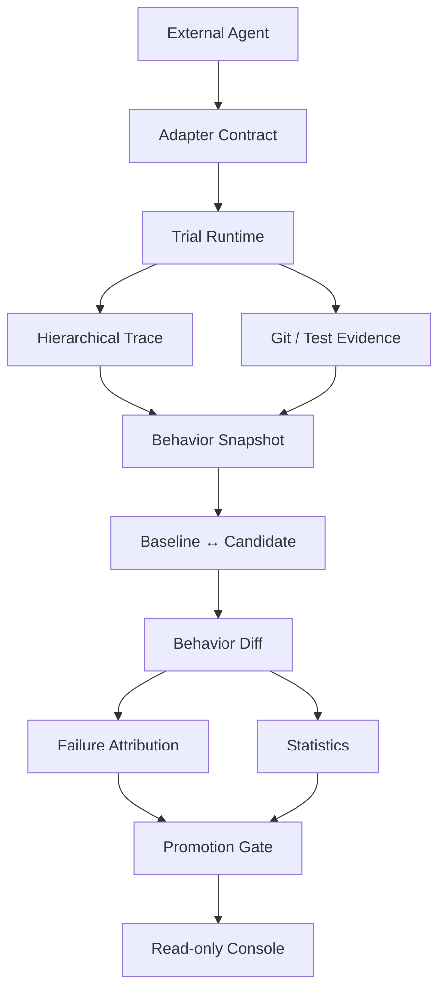

# Regression Lab v1.0

**Framework-neutral Agent regression evaluation and observability platform for reproducible version comparison.**

Regression Lab 不把一次 Agent 运行当成“任务成功/失败”的黑盒，而是把它变成一条可复查的工程证据链：同一 Case 上的 Baseline 与 Candidate 到底做了什么、为什么更好或更差、失败发生在哪个 Span，以及是否足以支持发布决策。



## 它解决什么问题

一个 Agent 版本“测试通过”还不足以证明它值得发布。工程决策通常还需要回答：

- 两个版本是否在同一组可复现的 Case × Trial 条件下比较？
- Candidate 的 Token、耗时或工具调用变化，来自什么可观察的行为变化？
- 一个失败能否回到具体的 Trace Span、工具调用、测试或 Git Evidence？
- 缺少证据时，系统会不会把 unknown 伪装成 `0`？
- 通过率不变、但成本明显退化时，Gate 会不会阻止晋级？

Regression Lab 将这些问题统一在一次版本实验中，而不是依赖人工读日志或单一平均分。

## 核心链路

| 层次 | 职责 | 关键输出 |
|---|---|---|
| External Agent | 任意可信本地 Coding Agent | 通过 JSON argv 启动，不绑定框架 |
| Adapter Contract | 隔离平台与 Agent 的职责 | Trial 身份、受控输出、Capability Snapshot |
| Trial Runtime | 独立 Worktree、测试、Git Evidence、预算 | 不可变 Attempt 与选中的 Trial 投影 |
| Hierarchical Trace | 记录通用 agent/workflow/llm/tool Span | JSONL Trace，保留父子关系 |
| Behavior Snapshot | 从 Trace/Result 提取可量化行为 | Tool、Token、延迟、重复读取、重试等 |
| Behavior Diff | 配对 Baseline/Candidate Trial | Delta、语义模式、Case 聚合 |
| Failure Attribution | 基于确定性证据定位失败 | kind、reason、failure Span、evidence |
| Promotion Gate | 独立于诊断层的发布判断 | `PROMOTE` / `HOLD` / 不可用原因 |
| Console | 只读查看实验、Case、Trial 与 Trace | 从版本差异 drill down 到原始证据 |

## 为什么不是“另一个 Agent 框架”

Regression Lab 不负责规划、记忆、工具编排或替代 Agent Runtime。它只要求外部 Agent 通过 Observer SDK 输出通用 Trace，并由平台独立完成测试、Git Diff、Evaluator 和 Gate。

因此同一条链路可接入：

- 内置的最小 `react-agent`；
- 任意满足 JSONL Observer Contract 的 `external-command` Agent；
- 真实 [LangGraph 集成示例](docs/LANGGRAPH_INTEGRATION.md)，无需新增 LangGraph Adapter 或框架专属核心分支。

## 已验证的证据

正式外部 Agent Benchmark 使用 **11 Case × 3 Trial × 2 Version = 66 个选中 Trial**：

| 对比 | 有效通过 | 关键行为变化 | Gate |
|---|---:|---|---|
| external-openai-v3 → external-openai-v4.1 | 33/33 → 33/33 | 平均少 11,660 Token（-66.3%）、少 2.82 次工具调用、少 11.21 秒 | `PROMOTE` |
| external-openai-v3 → external-openai-v3-negative | 33/33 → 33/33 | 两次受控的终止后冗余模型调用，平均 Token +49.9% | `HOLD` |

这两组实验同时证明：平台既能把效率改善追溯到行为差异，也能在正确率不变时拦截成本退化。详见 [V3→V4.1 正向报告](docs/EXPERIMENT_REPORT_EXTERNAL_V3_V4_1_BENCHMARK_V2.md) 与 [V3→V3-negative 负向对照](docs/EXPERIMENT_REPORT_EXTERNAL_V3_NEGATIVE_CONTROL_BENCHMARK_V2.md)。

## 快速开始

要求：Python 3.11、Git；Docker Desktop 用于容器隔离验收。核心运行时不依赖第三方 Python 包；真实模型与 LangGraph 示例是可选集成边界。

```bash
# Clone 后进入仓库根目录
cd <repository-root>

python3.11 -m venv .venv
source .venv/bin/activate
pip install -e .

make test
make manifest-check
make docker-test       # Docker 可用时
make failure-suite     # Docker 可用时
```

这些命令只执行离线测试和 Manifest 校验，不会调用真实模型。

### 查看一个已有实验

Console 只读取本机已有的 Experiment Artifact；`.runtime/` 默认不纳入 Git，因此克隆仓库后需先自行运行或恢复一个实验目录。

```bash
make console RUNTIME=<experiment-runtime-directory>
```

打开 `http://127.0.0.1:8765`。如果默认端口已被占用，可指定 `CONSOLE_PORT=8767`；Console 不执行 Agent、不调用模型、不会写入 Artifact 或暴露密钥。界面说明见 [Web Console](docs/WEB_CONSOLE.md)。

## 三分钟验证 Black-box 接入

下面的最小 Agent 只接收通用的 `--workspace` 和 `--task` 参数，不 import Regression Lab、不读取 `REGRESSION_*` 环境变量，也不需要模型配置。它用于验证本机安装、Worktree、Git/Test Evidence 和平台生命周期 Trace。

```bash
cat > blackbox-smoke.yaml <<EOF
schema_version: 1
agent:
  id: blackbox-smoke-agent
  version: v1
runtime:
  command:
    - "$(command -v python)"
    - "$(pwd)/examples/external_blackbox_agent.py"
    - --workspace
    - "{workspace}"
    - --task
    - "{task}"
observation:
  mode: blackbox
EOF

regression-lab --help
regression-lab agent validate blackbox-smoke.yaml
regression-lab agent smoke blackbox-smoke.yaml --unsafe-trusted-host
```

Smoke 成功后会打印 Runtime；可按输出中的命令启动 Console。Black-box 只提供 Agent 进程生命周期、Git 与平台测试证据，因此模型调用、Token、工具调用和 workflow Trace 会明确显示为 `N/A`，不会补成 `0`。

## 接入一个外部 Agent

平台以 `shell=false` 执行显式 JSON argv。Black-box Agent 只需接收 `--workspace {workspace}` 与 `--task {task}`；若希望获得模型、工具和 workflow 证据，则使用 SDK 模式并由 Agent 输出 Trace。平台始终独立采集测试、Diff 和评分结论。

```python
from regression_lab.sdk import AgentObserver

observer = AgentObserver.from_environment()
with observer.run():
    with observer.model_call(model="your-model") as call:
        call.record_usage({"prompt_tokens": 120, "completion_tokens": 30, "total_tokens": 150})
    with observer.tool_call("edit_file"):
        ...

AgentObserver.write_agent_output("done", "completed")
```

完整环境变量、事件字段和受控输出约束见 [External Agent Integration Contract](docs/EXTERNAL_AGENT_INTEGRATION_CONTRACT.md)。无模型最小示例可运行：

```bash
PYTHONPATH=src:. python3.11 scripts/run_benchmark.py \
  --adapter external-command \
  --agent-version external-example-v1 \
  --external-command '["python3.11", "examples/external_python_agent.py"]' \
  --manifest benchmarks/smoke-case-design.yaml \
  --output-dir .runtime/external-example \
  --unsafe-trusted-host
```

要评测自己的项目，请准备基线 Fixture、Case Manifest 和两个 Agent 版本，按 [Using Your Agent](docs/USING_YOUR_AGENT.md) 执行。平台复制 Fixture 到隔离 Worktree 后再运行 Trial，不会修改用户原始项目。

## v1.0 稳定边界

当前版本为 **v1.0.0**。以下语义已经冻结：

- Trace Schema v1；
- Behavior Diff v1；
- Adapter Capability Contract v2；
- Experiment schema；
- Gate semantics；
- Trial / Attempt semantics。

其中 Capability 明确区分 `available`、`supported_but_not_observed` 和 `unsupported`；未支持或未观测到的证据不会显示为 `0`。Behavior Diff 与 Failure Attribution 都是 diagnostic，不直接改变 Gate。

冻结后的变更纪律、兼容要求与当前能力边界见 [v1.0 Freeze](docs/V1_0_FREEZE.md)。新想法先进入 [Roadmap](docs/ROADMAP.md)，不直接改变稳定契约。

## 项目结构

```text
adapters/       Agent 适配 Worker（包含通用 external-command）
benchmarks/     版本实验使用的确定性 Case Manifest
fixtures/       有缺陷的最小代码任务与测试
src/            Trace、Evaluator、Experiment、Gate、Console 读取层
scripts/        Benchmark、Experiment、报告与 Console CLI
examples/       外部 Agent 与 LangGraph 集成示例
tests/          离线单元测试与 Docker 集成测试
docs/           契约、实验报告、冻结边界与路线图
```

## 当前范围与非目标

- 本项目是本地、单机、受信任 Agent 的评测与观测平台；不是多租户 SaaS，也不提供远程 Artifact 服务。
- `external-command` 只运行用户明确配置的可信本地命令；它不是不可信代码沙箱。
- 不做 LLM 自动根因分析，不让诊断指标参与 Gate，也不在核心中加入 LangGraph、MCP 或 Multi-Agent 特判。

## CI

每次 push 与 pull request 都使用 Python 3.11 执行离线单测、Docker Sandbox 集成测试、Failure Suite 与所有 Benchmark Manifest 校验；不需要模型密钥，也不会调用真实模型。工作流定义见 [verify.yml](.github/workflows/verify.yml)。
