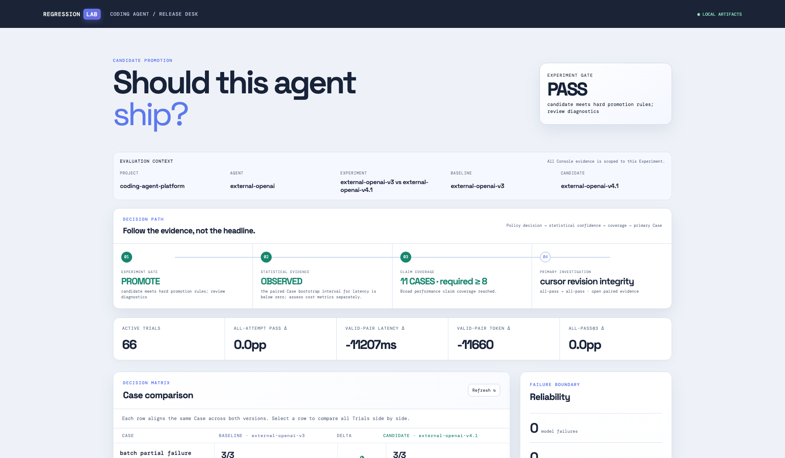
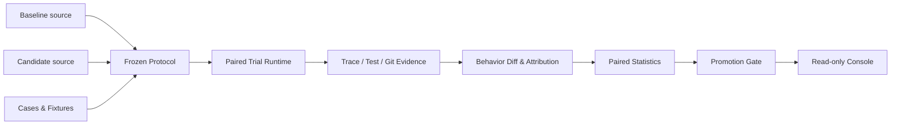

# Regression Lab

**在发布 Coding Agent 新版本之前，用可复现的实验回答：它真的更好吗？**

Regression Lab 是一个本地优先、框架无关的 Agent 回归评测与可观测性平台。它在冻结的 Case 和执行协议下配对运行 Baseline 与 Candidate，把测试结果、Git Diff、层级 Trace、Token、延迟和工具调用汇成一条可复查的证据链，最终给出 `PROMOTE`、`HOLD` 或 `INCONCLUSIVE` Gate 结论。

[快速开始](#快速开始) · [接入自己的-agent](#接入自己的-agent) · [证据模型](#证据模型) · [架构](#工作原理) · [文档](#文档导航)



## 为什么需要它

Agent 的一次“任务完成”不能证明新版本值得发布。真实的回归判断还需要回答：

- 两个版本是否使用同一 Case、Fixture、重复序号和评测口径？
- 正确率相同的时候，Candidate 是否更慢、更贵或调用了更多工具？
- 失败最早发生在哪个 workflow、模型或工具 Span？
- Token、Tool Trace 等指标来自平台、框架回调还是 Agent 自报？
- 当证据缺失时，系统是否明确显示 `N/A`，而不是用 `0` 掩盖未知？

Regression Lab 将这些问题放进同一份冻结实验，而不是依赖人工拼接日志和平均值。

## 核心能力

| 能力 | 你得到什么 |
|---|---|
| 配对版本实验 | 同一 `Case × repeat` 内严格按 Baseline → Candidate 执行 |
| 冻结执行协议 | 固定源码身份、Case、Fixture、模型配置、超时、Pair 顺序和并发度 |
| 层级 Trace | 展开 `agent → workflow → model/tool`，查看耗时、状态与调用关系 |
| 同步 Trace Diff | 三列对齐 Baseline / Delta / Candidate，定位首个行为分叉和关键路径 |
| Failure Attribution | 用确定性证据区分 Agent、模型、Trace、测试和策略失败 |
| Promotion Gate | 同时评估正确性、统计覆盖、成本预算和证据来源 |
| Artifact Verify | 离线校验 Protocol、Execution Plan、Attempt、Trace、源码与环境身份 |
| Pair 级并发 | 最多并行两个独立 Pair；同一 Pair 的两个版本仍保持串行 |

## 快速开始

需要 Python 3.11+、Git 和 [uv](https://docs.astral.sh/uv/)。无需克隆仓库，也无需手写 YAML：

```bash
uvx --from "git+https://github.com/Zsyyyyyyyy/agent-observability-and-evaluation-platform.git@v1.4.0" \
  regression-lab start
```

Studio 会在本机打开并引导你完成：

1. 选择同一 Git 仓库的历史 commit/tag 与当前工作区，或填写两个独立 Agent；
2. 指定两个版本各自的 Python 与启动入口；
3. 选择 Benchmark Case、重复次数、运行边界和观测方式；
4. Preflight 确认源码身份和理论硬截止后启动实验；
5. 在 Console 中从 Gate 下钻到 Case、Trial、Trace 和 Git Diff。

先验证安装和资源是否完整：

```bash
uvx --from "git+https://github.com/Zsyyyyyyyy/agent-observability-and-evaluation-platform.git@v1.4.0" \
  regression-lab doctor
```

只想浏览界面和证据链，可打开完全离线的只读 Demo。它不执行 Agent，也不调用模型：

```bash
uvx --from "git+https://github.com/Zsyyyyyyyy/agent-observability-and-evaluation-platform.git@v1.4.0" \
  regression-lab demo
```

长期使用可以安装 CLI：

```bash
uv tool install \
  "git+https://github.com/Zsyyyyyyyy/agent-observability-and-evaluation-platform.git@v1.4.0"

regression-lab start
```

## 接入自己的 Agent

平台不接管 Agent 的规划、记忆或工具系统。它以 `shell=false` 启动显式 argv，并提供三种观测层级：

| 模式 | Agent 改动 | 可获得的证据 |
|---|---|---|
| Black-box | 无需 import 平台代码 | 进程生命周期、测试、Git Diff；模型和工具指标为 `N/A` |
| LangGraph callback | 在 `invoke/stream` 入口注入一次 Callback | workflow、model、tool Span 与框架观测到的用量 |
| Native SDK | 用 Observer SDK 包裹关键调用 | Agent 主动上报的模型、工具和自定义 Span |

最常见的方式是直接在 Studio 选择 **Same Git repository**：

- Baseline 填历史 commit 或 tag；
- Candidate 选择当前 working tree 或另一个 commit；
- 两个版本依赖不同时，分别指定已经准备好的 Python interpreter；
- LangGraph Agent 选择 `LangGraph · framework callback`；其他 Agent 可以先从 Black-box 开始。

平台会在系统临时目录中创建源码快照，不会对原仓库执行 checkout、stash 或 commit。Candidate 的 tracked 修改和未跟踪文件会进入快照；`.gitignore` 排除的 `.env`、`.venv` 等文件不会进入。

详细步骤见 [使用自己的 Agent](docs/USING_YOUR_AGENT.md)，LangGraph 接入见 [LangGraph Integration](docs/LANGGRAPH_INTEGRATION.md)，底层 argv、环境和输出约束见 [External Agent Integration Contract](docs/EXTERNAL_AGENT_INTEGRATION_CONTRACT.md)。

## 从结论回到证据

Console 的阅读路径刻意保持从结论到原始证据：

```text
Promotion Gate
  └─ Version summary / statistical coverage
      └─ Case comparison
          └─ Paired Trial
              ├─ Synchronized Trace Diff
              ├─ Failure Attribution
              ├─ Hierarchical Trace
              └─ Git Diff / stdout / stderr
```

正式外部 Agent Benchmark 已覆盖 **11 Cases × 3 repeats × 2 versions = 66 Trials**：

| 对比 | 有效通过 | 关键变化 | Gate |
|---|---:|---|---|
| external-openai-v3 → v4.1 | 33/33 → 33/33 | 平均 Token -66.3%，工具调用 -2.82，延迟 -11.21s | `PROMOTE` |
| external-openai-v3 → negative control | 33/33 → 33/33 | 正确率不变，平均 Token +49.9% | `HOLD` |

这两组对照说明 Gate 不只看通过率：效率改善可以回到行为证据，成本退化也会在正确率不变时被拦截。查看 [正向报告](docs/EXPERIMENT_REPORT_EXTERNAL_V3_V4_1_BENCHMARK_V2.md) 和 [负向对照](docs/EXPERIMENT_REPORT_EXTERNAL_V3_NEGATIVE_CONTROL_BENCHMARK_V2.md)。

## 证据模型

Regression Lab 将“观察到什么”和“谁提供了证据”分开记录：

| 来源 | 语义 | 典型证据 |
|---|---|---|
| `platform_observed` | 平台独立观察 | 进程状态、测试结果、Git Diff、wall time |
| `framework_observed` | 框架回调采集 | LangGraph workflow/model/tool Trace、Token |
| `sdk_self_reported` | Agent 通过 SDK 自报 | Native SDK 模型用量和工具调用 |
| `not_observed` | 本次没有可信观测 | 显示 `N/A`，不转换成零 |

Model Usage 与 Tool Trace 分别校验来源和覆盖率；只有部分 Trial 有指标时，不会用局部平均值支持晋级。Behavior Diff 和 Failure Attribution 只负责诊断，不直接修改 Gate。

Artifact Verify 用于证明 Runtime 中的文件仍与冻结摘要一致。它不是数字签名、可信时间戳或远程来源认证，也不能防止拥有本机全部权限的人同时重写 Artifact 和摘要。完整规则见 [Gate Policy](docs/GATE_POLICY.md) 与 [Experiment Protocol](docs/EXPERIMENT_PROTOCOL.md)。

## 工作原理


```mermaid
flowchart LR
    A[Baseline source] --> P[Frozen Protocol]
    B[Candidate source] --> P
    C[Cases & Fixtures] --> P
    P --> R[Paired Trial Runtime]
    R --> T[Trace / Test / Git Evidence]
    T --> D[Behavior Diff & Attribution]
    D --> S[Paired Statistics]
    S --> G[Promotion Gate]
    G --> O[Read-only Console]
```

每个 Trial 都有独立的 Fixture、Workspace、Attempt、Trace、stdout/stderr 和 Result。开启 `concurrency=2` 时，并发单位是 `Case × repeat` 的 Pair；不同 Pair 可以重叠，同一 Pair 内始终保持 Baseline → Candidate，因此原有配对键和统计语义不变。

完整 Runtime 可以离线验证，不会重新执行 Agent 或调用模型：

```bash
regression-lab experiment verify --runtime <experiment-runtime-directory>
```

## 本地边界与安全

- Studio 和 Console 仅监听 `127.0.0.1`，Artifact 默认保存在 `~/.regression-lab/`。
- 项目面向本地、单机、受信任 Agent；不是多租户 SaaS，也不是不可信代码沙箱。
- Docker 是平台测试命令的默认隔离边界，不会自动把 Agent 进程变成容器沙箱。
- Trusted host 只适用于你明确信任的本地命令，并要求在 Studio 中显式确认。
- Agent 默认只继承运行所需变量、`AGENT_*` 和 OpenAI-compatible 模型配置，不会接收平台进程的全部环境变量。
- Prompt、工具参数和工具输出正文默认不会写入公开展示证据。

执行与进程生命周期保证见 [Execution Reliability Contract](docs/EXECUTION_RELIABILITY_CONTRACT.md)，安全模型和漏洞报告方式见 [SECURITY.md](SECURITY.md)。

## 开发与验证

```bash
git clone https://github.com/Zsyyyyyyyy/agent-observability-and-evaluation-platform.git
cd agent-observability-and-evaluation-platform

python3.11 -m venv .venv
source .venv/bin/activate
pip install -e .

make verify
make offline-demo
```

`make verify` 运行完整离线单元测试、Benchmark Manifest 校验、Python 编译、前端语法检查、两个 Demo 的摘要验证和 Git diff 检查，不需要模型密钥。Docker 可用时还可以运行：

```bash
make docker-test
make failure-suite
```

CI 对每次 push 和 pull request 执行同一套离线验证、Docker Sandbox 集成测试和 Failure Suite。贡献约定见 [CONTRIBUTING.md](CONTRIBUTING.md)。

## 项目结构

```text
adapters/       外部 Agent 与只读回放适配器
benchmarks/     可版本化的 Case Manifest
fixtures/       隔离运行的最小代码任务与测试
src/            Trace、Evaluator、Gate、Artifact 与 Console 核心
scripts/        CLI、实验执行、验证与本地服务入口
web/            Studio 和只读 Console 前端
demo/           脱敏且可校验的离线 Runtime
tests/          离线测试与 Docker 集成测试
docs/           协议、契约、实验报告和路线图
```

## 文档导航

| 你想了解 | 文档 |
|---|---|
| 如何评测自己的 Agent | [Using Your Agent](docs/USING_YOUR_AGENT.md) |
| 实验中冻结了什么 | [Experiment Protocol](docs/EXPERIMENT_PROTOCOL.md) |
| Trace 的事件和父子关系 | [Trace Schema](docs/TRACE_SCHEMA.md) |
| Gate 如何处理正确性、成本和证据来源 | [Gate Policy](docs/GATE_POLICY.md) |
| Attempt 选择和恢复语义 | [Attempt Selection Contract](docs/ATTEMPT_SELECTION_CONTRACT.md) · [Resume](docs/RESUME.md) |
| 从运行到发布结论的完整架构 | [Architecture Walkthrough](docs/ARCHITECTURE_WALKTHROUGH.md) |
| 当前能力边界与后续方向 | [Roadmap](docs/ROADMAP.md) |

## 当前定位

v1.4 是一个可公开演示、可离线验证、可安全接入可信本地 Agent 的版本回归平台。它已经覆盖双版本实验、Pair 并发、Trace Diff、Failure Attribution、Gate 和 Artifact Verify，但不宣称是生产级多租户平台，也不提供远程 Artifact 服务或 LLM 自动根因分析。

版本变化见 [CHANGELOG.md](CHANGELOG.md)。本项目采用 [MIT License](LICENSE)。
