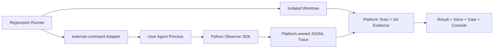

# External Agent Integration Contract v1

> 状态：MVP 已实现。HTTP/OTel Transport 与框架专用封装仍不在 v1 范围内。

## 1. 目标

让任意本地 Coding Agent 以一个外部命令接入 Regression Lab，而不要求它采用 ReAct、LangGraph、AutoGen 或其他特定框架。接入后，平台能够：

- 采集 `agent.run`、`model.call`、`tool.call` 与错误事件；
- 展示真实模型名称、工具名称、Token、耗时和状态；
- 继续由平台运行测试、采集 Git Diff、执行确定性 Evaluator；
- 用同一组 Case 对两个 Agent 版本执行实验并应用 Promotion Gate。

“框架无关”描述的是进程和 Trace 契约，不要求用户重新实现一个生产级 Agent。仓库只提供一个最小外部示例用于验收。

## 2. MVP 决策

v1 采用本地优先的三层结构：



### v1 包含

- `external-command` Adapter：在平台准备的 Worktree 中启动用户 Agent 命令；
- 通用 JSONL Trace 协议：复用现有 `TraceCollector` 和校验器格式；
- 轻量 Python Observer SDK：为原生 Python Agent 提供上下文管理器；
- 一个原生 Python 外部 Agent 示例；
- 同 Agent、同模型、同工具、仅 Prompt 不同的 v1/v2 对照实验。
- 由 [Evaluation Metrics v2](EVALUATION_METRICS_V2.md) 定义的稳定性、效率与工具行为指标。

### v1 不包含

- 公网或远程 Agent 上报；
- 多租户、登录、鉴权和团队协作；
- LangChain、LangGraph、AutoGen 等框架专用封装；
- Agent 自报的测试结果或评分成为权威结果；
- 新建第二套 Trace、Result 或 Store 数据模型。

HTTP Ingest API 延后到 v2。v1 先验证事件契约和评测闭环，避免过早引入写服务、鉴权与幂等问题。

## 3. 信任边界

外部 Agent 只负责执行任务并产生观测事件。以下内容始终由平台拥有：

| 数据/行为 | 所有者 | 原因 |
|---|---|---|
| Worktree 创建与基线 Revision | 平台 | 防止 Agent 选择有利输入 |
| Case、Prompt、路径与工具 Policy | 平台 | 保证实验条件一致 |
| JSONL Trace 文件和 Trace ID | 平台 | 防止覆盖其他 Trial |
| Agent 模型/工具调用事件 | Agent SDK | 只有调用方知道真实调用现场 |
| 测试执行、Git Diff、Changed Files | 平台 | 不信任 Agent 自报验收结果 |
| Evaluator、Score、Gate | 平台 | 保证晋级结论可审计 |

Agent 可以上报 `agent_response`、Usage 和错误摘要，但不能提交权威 `scores`、`evaluation.passed` 或 Gate 结论。

## 4. 外部命令接口

平台通过 `external-command` Adapter 启动一个显式配置的命令。命令继承当前 Trial 的受控环境，并接收以下环境变量：

| 环境变量 | 必需 | 说明 |
|---|---:|---|
| `REGRESSION_TRIAL_ID` | 是 | 当前 Trial 的稳定身份 |
| `REGRESSION_TRACE_ID` | 是 | 平台生成的 Trace 身份 |
| `REGRESSION_TRACE_PATH` | 是 | 仅属于当前 Trial 的 JSONL 输出路径 |
| `REGRESSION_AGENT_OUTPUT_PATH` | 是 | Agent 最终回答的受控 JSON 输出路径 |
| `REGRESSION_WORKTREE` | 是 | 平台准备的工作目录 |
| `REGRESSION_CASE_ID` | 是 | Benchmark Case 身份 |
| `REGRESSION_AGENT_VERSION` | 是 | 例如 `external-agent-v1` |
| `REGRESSION_AGENT_PROFILE` | 否 | 例如 `prompt-basic-v1` |

外部命令必须：

1. 只在 `REGRESSION_WORKTREE` 内执行任务；
2. 使用平台分配的 Trace ID 和 Trace Path；
3. 在退出前关闭所有已创建 Span；
4. 用退出码表达进程是否正常结束，但不能用退出码代替平台评测；
5. 将简短最终回答写入 `REGRESSION_AGENT_OUTPUT_PATH`；stdout/stderr 只作为进程诊断信息，不解析为业务结果。

Manifest 中的外部命令必须是 argv 数组，例如：

```json
{
  "adapter": {
    "id": "external-command",
    "command": ["python", "/absolute/path/to/my_agent.py"]
  }
}
```

Adapter 必须以 `shell=false` 语义启动该数组，不接受未经拆分的 Shell 命令字符串。Agent 输出文件只允许以下字段，其他字段由 Adapter 忽略：

```json
{
  "agent_response": "fixed empty input handling",
  "agent_exit_reason": "model_completed"
}
```

平台不得把模型密钥写入 Trial Spec、Trace、Result 或 Store。密钥仅通过外部 Agent 自己的进程环境读取。

当 `agent_exit_reason` 为 `model_error` 时，Agent 可以额外写入可选
`model_failure_kind`。它只能是脱敏类别：`configuration`、`http_429`、
`http_4xx`、`http_5xx`、`timeout`、`network`、`invalid_response`、
`invalid_tool_call` 或 `unknown`。平台拒绝其他值，并将该类别写入
Result 的 `model_failure.kind`；不得记录 HTTP 响应正文、请求正文或密钥。

v1 规定一个 Trial 只有一个 Agent 进程、一个 Observer 实例和一个 Trace Writer。平台先分配独占路径，SDK 在 Agent 启动时创建文件并从 `event_seq=1` 开始写入；不支持多个进程并发追加同一 JSONL。需要子进程或分布式 Trace 的 Agent 留到 HTTP/OTel 阶段接入。

最终输出文件必须是 UTF-8 JSON 对象，`agent_response` 最长 4096 字符，`agent_exit_reason` 最长 128 字符。Agent 应先写同目录临时文件再原子替换目标文件；缺失、超限或解析失败均由 Adapter 记录为失败证据，不能回退解析 stdout。

### 本地安全限制

v1 的外部命令是用户显式配置并信任的本地开发进程，不是任意第三方代码执行平台。Worktree 和事后 Evaluator 能限制实验输入、检测越界修改，但无法阻止一个恶意本地进程主动读取宿主机其他文件。

因此 v1 必须：

- 只运行用户明确指定的 Agent 命令；
- 不通过 HTTP 接收任意可执行命令；
- 不把“路径策略检测”描述为“宿主机级强隔离”；
- 将不可信 Agent 的容器化 Worker、网络代理和 Secret Broker 延后到后续安全阶段。

同样，JSONL 是可审计的观测证据，不是防篡改账本。外部进程可以尝试写入错误身份或伪造事件；平台必须将 Trace 中的 Trial ID、Trace ID、版本和 Adapter 与预期值交叉校验，不匹配即拒绝该 Trial。v1 不宣称能从主机层证明 Agent 没有执行未埋点的工具调用。

## 5. Trace 协议

v1 复用现有 JSONL Event Shape。每行是一个 JSON 对象：

```json
{
  "trace_id": "trace_abc123",
  "event_seq": 1,
  "ts": 1770000000.125,
  "kind": "span_start",
  "span_id": "span_0001",
  "parent_span_id": null,
  "name": "agent.run",
  "attributes": {
    "trial_id": "case_trial_001",
    "case_id": "case",
    "agent_version": "external-agent-v1",
    "adapter_id": "external-command"
  }
}
```

### 通用不变量

- 一个 Trace 只能使用一个非空 `trace_id`；
- `event_seq` 从正整数开始并严格递增；
- `ts` 必须是数字时间戳；
- 只允许 `span_start`、`span_end`、`event`；
- Trial 必须且只能有一个无父节点的根 Span；
- 子 Span 的父 Span 必须已开始；
- 每个 Span 必须且只能结束一次；
- 根 Span 必须命名为 `agent.run`，且 `attributes.trial_id` 必须匹配平台 Trial。

### 标准 Span

#### `agent.run`

必需开始属性：`trial_id`、`case_id`、`agent_version`、`adapter_id`。

建议开始属性：`agent_profile`、`sdk_version`。

必需结束属性：`duration_ms`。结束状态使用 `ok`、`agent_failed`、`model_failed`、`budget_exceeded` 或 `infra_failed`。

#### `model.call`

必需开始属性：`model`。

建议开始属性：`provider`、`message_count`、`tool_count`、`max_tokens`。禁止默认记录完整 Prompt、消息正文、Authorization Header 或 API Key。

建议结束属性：

```json
{
  "duration_ms": 1250.5,
  "finish_reason": "tool_calls",
  "tool_call_count": 1,
  "usage": {
    "prompt_tokens": 820,
    "completion_tokens": 95,
    "total_tokens": 915
  }
}
```

调用失败时，`model.call` 结束 Span 可以记录 `model_failure_kind`，根
Span 下的 `error` Event 也可以记录同名字段。字段只能使用上述脱敏类别。

#### `tool.call`

必需开始属性：`tool_name`。

建议开始属性：`tool_use_id`、脱敏后的 `argument_keys`、Worktree 相对的 `target_path` 与不可逆 `argument_fingerprint`。默认不记录完整工具参数。

建议结束属性：`duration_ms`、最多 240 字符的 `output_preview`。状态使用 `ok`、`error` 或 `denied`。

### 标准 Event

- `permission.check`：工具名称与 `allowed`/`denied` 决策；
- `context.compact`：压缩策略与消息数量，不记录完整消息；
- `error`：`error_type` 与最多 500 字符的脱敏错误摘要；
- `agent.stop`：退出原因，例如 `model_completed` 或 `max_tool_calls`。

## 6. Python SDK 目标接口

接口名称在实现前通过测试固定，预期使用方式如下：

```python
from regression_lab.sdk import AgentObserver

observer = AgentObserver.from_environment()

with observer.run():
    with observer.model_call(model="qwen3.6-plus") as call:
        reply = model_client.complete(messages)
        call.record_usage(reply.usage)

    with observer.tool_call("read_file") as tool:
        output = read_file("src/calculator.py")
        tool.preview(output)
```

SDK 写入失败不得中断 Agent 主流程，但平台最终必须将缺失或不完整的 Trace 判为 `trace_incomplete`。这实现了“Agent 可继续执行、晋级证据必须 fail-closed”。

SDK 必须对常规写入串行化，但 v1 不提供跨进程锁。`model_usage` 由 Adapter/平台从已校验的 `model.call` 结束事件聚合，不能从最终输出文件读取。Tool Integrity 只能验证已观测调用是否合规；未埋点调用的不可见性属于 v1 已知限制，因此官方示例和 Promotion 实验必须通过 SDK 包裹所有模型与工具调用。

## 7. Result 与评测

`external-command` Adapter 负责把外部进程结果转换为现有 Result Shape，至少包含：

```json
{
  "trial_id": "case_trial_001",
  "adapter_id": "external-command",
  "agent_version": "external-agent-v1",
  "agent_profile": "prompt-basic-v1",
  "status": "completed",
  "trace_id": "trace_abc123",
  "agent_response": "fixed empty input handling",
  "model_usage": {
    "total_tokens": 915
  }
}
```

随后平台沿用现有流程补充：

- `changed_files`、`git_diff`、`git_evidence`；
- `test_exit_code`、测试输出与耗时；
- `trace_validation` 与 `trace_summary`；
- 六类确定性 Score；
- SQLite/JSONL Run Store 记录。

只有平台测试、Trace 校验和所有必要 Evaluator 均通过的 Trial，才可计入 Promotion Gate 的有效通过数。

## 8. 版本对比规则

首个外部 Agent 实验只改变 System Prompt。仓库参考命令为 `make external-experiment`，它运行 3 个 Case × 3 次 Trial × 2 个版本，共 18 次真实 Trial：

| 条件 | v1 | v2 |
|---|---|---|
| Agent 代码 | 相同 | 相同 |
| 模型与参数 | 相同 | 相同 |
| 工具集合 | 相同 | 相同 |
| Case、Trial 数、预算 | 相同 | 相同 |
| System Prompt | 通用修复指令 | Observe → Plan → Act → Verify |

对比指标沿用现有实验：通过率、模型失败率、Trace 完整率、平均工具调用、平均 Token、平均耗时和 Diff 规模。

## 9. Artifact 布局

外部 Agent Trial 必须沿用可被现有 Console 发现的目录形态：

```text
.runtime/external-agent-v1-v2/
  baseline/
    <case>_trial_001/
      trace.jsonl
      result.json
  candidate/
    <case>_trial_001/
      trace.jsonl
      result.json
  experiment.json
  gate-report.json
```

所有运行产物继续位于 `.runtime/`，不得提交到 Git。

## 10. 后续兼容方向

HTTP Ingest API、OpenTelemetry 转换器和框架封装必须映射到本契约，不得另建不兼容的事件语义。未来 Transport 可以变化，但 `agent.run`、`model.call`、`tool.call`、Result 和平台评测边界保持稳定。
